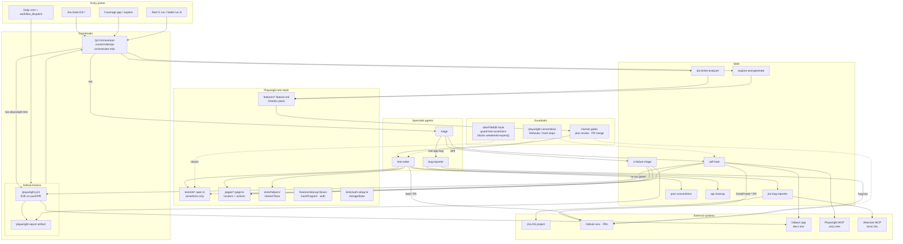
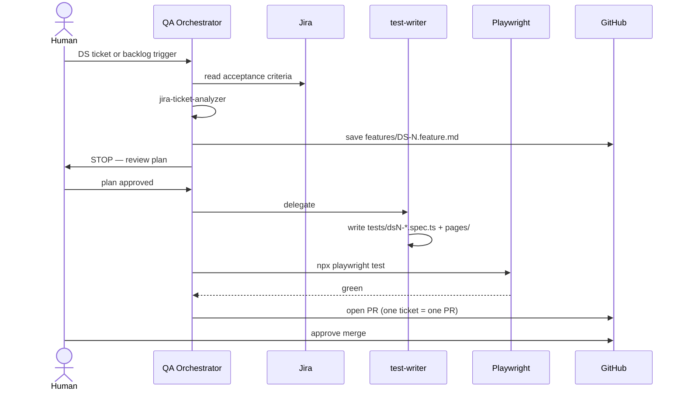
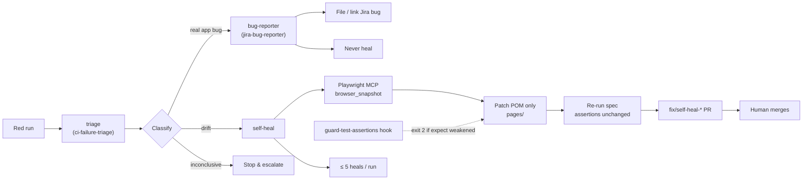
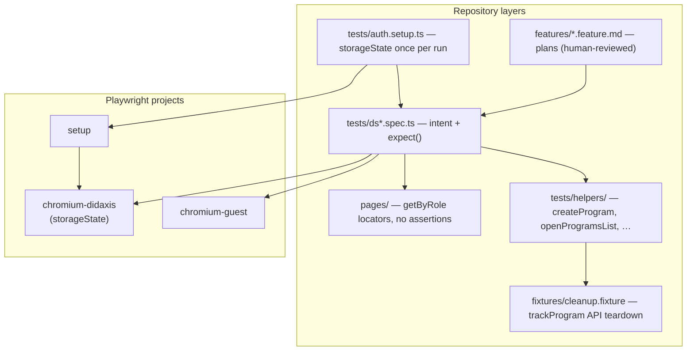

# QA Harness Architecture

Overview of the Didaxis QA harness: agent coordination, Playwright test stack, CI, and guardrails.

## System overview

## Ticket → green (happy path)

## Heal on red

## Test stack layout

## Key constraints

| Layer | Constraint |
|-------|------------|
| **Orchestrator** | ≤5 delegations/task · ≤5 self-heals/run · never merge without human |
| **Triage** | Read-only — classify, never fix |
| **Self-heal** | POM only · assertions unchanged · drift only |
| **Hook** | Blocks deleted/commented `expect(` in `tests/**` |
| **Playwright rules** | Refusals: no assertion weakening, no CSS/XPath, no `waitForTimeout` |
| **CI** | `playwright.yml` on every PR · `qa-orchestrator.yml` daily backlog (≤5 tickets) |

## Related files

| Component | Path |
|-----------|------|
| Orchestrator rule | `.cursor/rules/qa-orchestrator.mdc` |
| Playwright conventions | `.cursor/rules/playwright-conventions.mdc` |
| Assertion guard hook | `.cursor/hooks.json`, `.cursor/hooks/guard-test-assertions.*` |
| E2E workflow | `.github/workflows/playwright.yml` |
| Backlog orchestrator | `.github/workflows/qa-orchestrator.yml` |
| Headless prompt | `.github/qa-orchestrator-prompt.md` |
| Agents | `.cursor/agents/test-writer.md`, `triage.md`, `bug-reporter.md` |
| Skills | `.cursor/skills/` |
